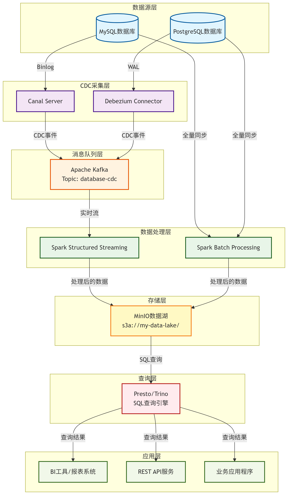

# Getting Started

## What is this?

This is a demo for data lake.

### Bigdata techs

#### CDC
- Canal

#### message framework
- Apache Kafka

#### store stream framework
- Apache Spark

#### qurery framework
- Presto/Trino

### Bigdata database choices

#### MinIo

MinIo for local data lake first, if you don't put it on clouds.

#### AWS

AWS for cloud data lake.
